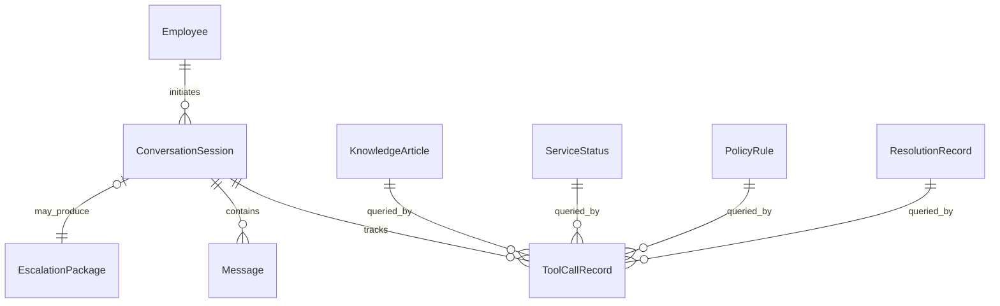

# Data Model: IT Helpdesk Agent

**Date**: 2026-05-28

## Entity Relationship



## Core Entities

### Employee

| Field | Type | Description |
|-------|------|-------------|
| id | string | 唯一标识，如 `emp-001` |
| name | string | 全名 |
| email | string | 公司邮箱 |
| department | string | 部门 |
| role | string | 职位 |
| location | string | 办公地点（Chicago, Remote, SF） |
| manager_id | string? | 直属经理 |
| equipment | list[string] | 分配设备 |
| permissions | list[string] | 当前权限列表 |
| account_status | enum | active, locked, suspended |

**Validation**: email 必须 `@company.com` 后缀；locked 状态需有 `lock_reason`

### KnowledgeArticle

| Field | Type | Description |
|-------|------|-------------|
| id | string | 如 `kb-okta-reset` |
| title | string | 文章标题 |
| category | enum | password, vpn, software, access, hardware |
| tags | list[string] | 检索标签 |
| content | string | Markdown 正文 |
| last_updated | date | 最后更新 |

### ServiceStatus

| Field | Type | Description |
|-------|------|-------------|
| service_id | string | 如 `okta`, `salesforce`, `vpn-gateway` |
| name | string | 显示名 |
| health | enum | healthy, degraded, outage, maintenance |
| affected_regions | list[string] | 影响区域 |
| description | string | 问题描述 |
| eta_resolution | datetime? | 预计恢复 |
| changelog | list[ChangeEvent] | 近期变更 |

### ChangeEvent

| Field | Type | Description |
|-------|------|-------------|
| timestamp | datetime | 变更时间 |
| description | string | 变更内容 |
| impact | string | 影响说明 |

### ResolutionRecord

| Field | Type | Description |
|-------|------|-------------|
| id | string | 案例 ID |
| problem_summary | string | 问题摘要 |
| symptoms | list[string] | 症状关键词 |
| systems_involved | list[string] | 涉及系统 |
| resolution | string | 解决方案 |
| resolved_at | datetime | 解决时间 |
| category | string | 分类 |

### PolicyRule

| Field | Type | Description |
|-------|------|-------------|
| id | string | 规则 ID |
| action | string | 操作类型，如 `grant_snowflake_prod` |
| agent_can_execute | bool | Agent 是否可直接执行 |
| approval_required | enum | none, manager, security, it_admin |
| conditions | list[string] | 前置条件描述 |
| description | string | 规则说明 |

## Session State (Runtime)

### ConversationState

LangGraph 状态对象，贯穿单次会话：

```python
class ConversationState(TypedDict):
    session_id: str
    employee_id: str | None
    messages: list[Message]
    diagnosis: Diagnosis
    tool_calls: list[ToolCallRecord]
    pending_questions: list[str]
    decision: Literal["clarify", "resolve", "escalate"] | None
    escalation_package: EscalationPackage | None
    turn_count: int
```

### Message

| Field | Type | Description |
|-------|------|-------------|
| role | enum | user, assistant, system |
| content | string | 消息内容 |
| timestamp | datetime | 时间戳 |

### Diagnosis

| Field | Type | Description |
|-------|------|-------------|
| hypothesis | string | 当前诊断假设 |
| confidence | float | 0.0–1.0 |
| category | string? | password, vpn, software, access, complex |
| investigated | list[string] | 已调查项 |
| remaining | list[string] | 待调查项 |

### ToolCallRecord

| Field | Type | Description |
|-------|------|-------------|
| tool_name | string | 工具名 |
| input | dict | 调用参数 |
| output | dict | 返回结果 |
| timestamp | datetime | 调用时间 |
| success | bool | 是否成功 |
| error | string? | 错误信息 |

### EscalationPackage

| Field | Type | Description |
|-------|------|-------------|
| issue_summary | string | 一句话摘要 |
| timeline | string | 问题时间线 |
| employee | EmployeeSnapshot | 员工上下文 |
| diagnosis | Diagnosis | 诊断结论 |
| tool_results_summary | string | 工具查询摘要 |
| attempted_steps | list[string] | 已尝试步骤 |
| recommended_priority | enum | P1, P2, P3 |
| target_team | string | 建议负责团队 |
| suggested_next_actions | list[string] | 人工建议动作 |

## State Transitions

| From | Event | To | Condition |
|------|-------|-----|-----------|
| intake | 信息不足 | clarify | missing required slots |
| intake | 信息足够 | investigate | category identified |
| clarify | 用户回复 | intake | new message added |
| investigate | 工具返回 | investigate | confidence < 0.7 |
| investigate | 可解决 | resolve | KB match + policy allow |
| investigate | 需升级 | escalate | policy deny OR complex OR confidence exhausted |
| resolve | — | end | steps delivered |
| escalate | — | end | package delivered |

## Mock Data Inventory (Minimum)

| 数据源 | 文件数 | 覆盖场景 |
|--------|--------|----------|
| kb/ | 8–12 篇 | Okta, VPN, Salesforce, Snowflake, Grafana |
| status/ | 1 JSON (5 services) | Okta outage, SF degraded, VPN maintenance |
| users/ | 3–5 JSON | 不同部门/角色/状态 |
| history/ | 5–10 JSON | 类似问题历史 |
| policies/ | 1 JSON (10 rules) | 权限边界 |
