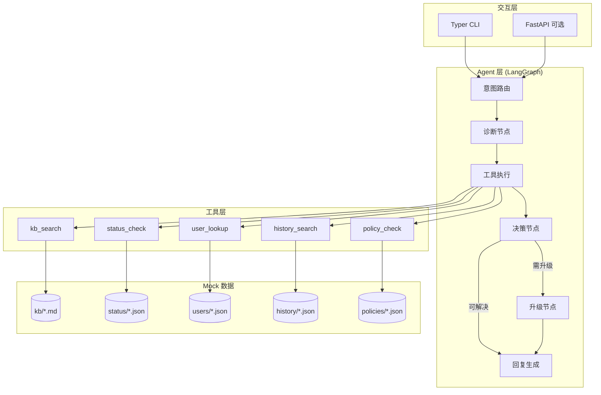
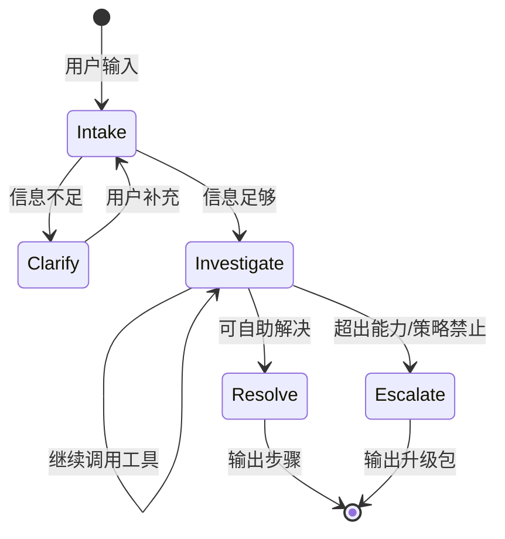

# Implementation Plan: IT Helpdesk Agent

**Branch**: `001-it-helpdesk-agent` | **Date**: 2026-05-28 | **Spec**: [spec.md](./spec.md)

**Input**: Feature specification from `/specs/001-it-helpdesk-agent/spec.md`

## Summary

构建一个面向员工的对话式 IT 支持 Agent，通过 LangGraph 编排多轮诊断流程，调用 5 类 Mock 工具（KB 搜索、系统状态、用户目录、历史案例、策略规则），在可自助解决时给出分步指引，超出能力时生成结构化升级包。交互层采用 CLI + 可选 Streamlit Web UI，评估层以对话脚本断言决策结果。

## Technical Context

**Language/Version**: Python 3.12

**Primary Dependencies**: LangGraph, LangChain, Google Gemini SDK (或 Anthropic SDK), FastAPI, Typer, Rich, Pydantic

**Storage**: 本地文件（JSON + Markdown），无数据库

**Testing**: pytest + 对话场景集成测试

**Target Platform**: macOS / Linux 本地运行

**Project Type**: single project（CLI + API + Agent core）

**Performance Goals**: 单轮 Agent 响应 < 15s（含 LLM + 工具调用）；评估套件全量 < 5min

**Constraints**: 仅依赖 LLM API 作为外部服务；Mock 数据总量 < 5MB；日志可本地查看

**Scale/Scope**: 单用户演示；5 类 Mock 数据源；5+ 评估场景；3 个 P1 用户故事

## Constitution Check

*GATE: Must pass before Phase 0 research. Re-check after Phase 1 design.*

| Principle | Status | Evidence |
|-----------|--------|----------|
| I. Employee-First | PASS | CLI/Web 聊天界面，面向员工自然语言输入 |
| II. Agentic, Not One-Shot | PASS | LangGraph 状态机，显式 diagnosis_state |
| III. Tool-Grounded | PASS | 5 个工具，Agent prompt 要求引用 tool output |
| IV. Resolution vs Escalation | PASS | policy_engine + escalation_builder |
| V. Evaluation-Driven | PASS | tests/eval/ 对话场景 + 断言 |
| VI. Simplicity & Local | PASS | 文件 Mock，Typer CLI，无 Docker 依赖 |

**Post-Design Re-check**: PASS — 无 Constitution 违规

## Project Structure

### Documentation (this feature)

```text
specs/001-it-helpdesk-agent/
├── plan.md              # 本文件
├── research.md          # 技术选型研究
├── data-model.md        # 数据模型
├── quickstart.md        # 快速启动
├── contracts/           # 接口契约
│   ├── agent-tools.md
│   └── cli-api.md
└── tasks.md             # /speckit-tasks 输出（待生成）
```

### Source Code (repository root)

```text
src/
├── agent/
│   ├── graph.py           # LangGraph 状态机定义
│   ├── nodes.py           # 诊断/工具/升级节点
│   ├── state.py           # ConversationState 类型
│   └── prompts.py         # System prompt 模板
├── tools/
│   ├── kb_search.py       # 知识库检索
│   ├── status_check.py    # 系统状态查询
│   ├── user_lookup.py     # 用户目录查询
│   ├── history_search.py  # 历史案例搜索
│   └── policy_check.py    # 策略规则判定
├── models/
│   └── schemas.py         # Pydantic 数据模型
├── data/                  # Mock 数据（JSON + Markdown）
│   ├── kb/
│   ├── status/
│   ├── users/
│   ├── history/
│   └── policies/
├── cli/
│   └── main.py            # Typer CLI 入口
└── api/
    └── server.py          # FastAPI（可选，供 Web UI）

tests/
├── unit/                  # 工具单元测试
├── integration/           # Agent 图集成测试
└── eval/                  # 对话场景评估
    ├── scenarios/         # YAML 场景定义
    └── runner.py          # 评估运行器

pyproject.toml
README.md
.env.example
```

**Structure Decision**: 单项目结构。Agent 核心与工具层分离，Mock 数据独立于代码，便于评估时替换场景数据。

## Architecture Overview



## Agent 状态机设计



**ConversationState 关键字段**:
- `messages`: 对话历史
- `employee_id`: 当前员工（可选，首次对话后绑定）
- `diagnosis`: 当前假设与置信度
- `tool_calls`: 已执行工具及结果
- `pending_questions`: 待追问项
- `decision`: `resolve` | `escalate` | `clarify`
- `escalation_package`: 升级摘要（若 applicable）

## Phase 0: Research Summary

详见 [research.md](./research.md)。关键决策：

| 决策 | 选择 | 理由 |
|------|------|------|
| Agent 框架 | LangGraph | 原生状态管理、工具循环、适合多轮诊断 |
| LLM | Google Gemini 2.0 Flash / Anthropic claude-sonnet | 工具调用稳定，可通过 env 切换 |
| KB 检索 | 关键词 + 简单 TF-IDF | Mock 数据量小，无需向量数据库 |
| 交互界面 | Typer CLI 为主 | 最低复杂度，面试 demo 友好 |
| 评估 | YAML 场景 + pytest | 可重复、可 CI |

## Phase 1: Design Artifacts

- [data-model.md](./data-model.md) — 实体与状态定义
- [contracts/agent-tools.md](./contracts/agent-tools.md) — 工具接口契约
- [contracts/cli-api.md](./contracts/cli-api.md) — CLI/API 契约
- [quickstart.md](./quickstart.md) — 本地运行指南

## Implementation Phases

### Phase A: 基础设施（Day 1）

1. 项目脚手架（pyproject.toml, src 结构）
2. Mock 数据创建（3+ 数据源，覆盖 5 个用户故事）
3. Pydantic schemas + 5 个 tool 实现
4. Tool 单元测试

### Phase B: Agent 核心（Day 1-2）

1. LangGraph 状态机 + prompts
2. 诊断 → 工具 → 决策 → 回复/升级 流程
3. 升级包生成器
4. CLI 入口（交互式对话）

### Phase C: 评估与文档（Day 2-3）

1. 5+ YAML 评估场景
2. eval runner + pytest 集成
3. README（架构、tradeoffs、运行、评估）
4. 可选：Streamlit demo UI

## Resolution vs. Escalation 边界

| 场景类型 | Agent 行为 | 判定依据 |
|----------|-----------|----------|
| KB 有 runbook + 无 outage | 直接给出步骤 | policy.allow_self_service = true |
| 已知 outage 影响用户 | 告知 ETA + 临时方案 | status.health != healthy |
| 权限：只读/非生产 | 模拟开通 + 确认 | policy.approval = none |
| 权限：生产/写 | 升级 + 生成审批请求 | policy.approval = manager/security |
| 多系统/无 KB/工具失败 | 升级 + 完整摘要 | confidence < threshold 或 retries exhausted |
| 策略禁止操作 | 拒绝 + 解释 | policy.agent_can_execute = false |

## Evaluation Strategy

每个场景 YAML 包含：
- `user_persona`: 模拟员工 ID
- `turns`: 用户消息列表
- `expected_decision`: resolve | escalate | clarify
- `expected_tools`: 至少应调用的工具
- `must_contain`: 回复中必须出现的关键词
- `must_not_contain`: 禁止幻觉内容

运行：`pytest tests/eval/ -v` 或 `python -m src.cli.main eval`

## Risk & Mitigation

| 风险 | 缓解 |
|------|------|
| LLM 幻觉 | Tool-grounded prompt + must_not_contain 评估 |
| 工具调用不稳定 | 重试 1 次 + 失败时透明告知 |
| 评估 flaky | 断言 decision/tools 而非 exact text |
| 演示时新问题 | Prompt 强调追问 + 通用 KB fallback |

## Complexity Tracking

无 Constitution 违规，无需复杂度豁免。

## Next Steps

1. 运行 `/speckit-tasks` 生成可执行任务列表
2. 运行 `/speckit-implement` 开始实现
3. 可选：运行 `/speckit-checklist` 生成 plan 质量检查清单
