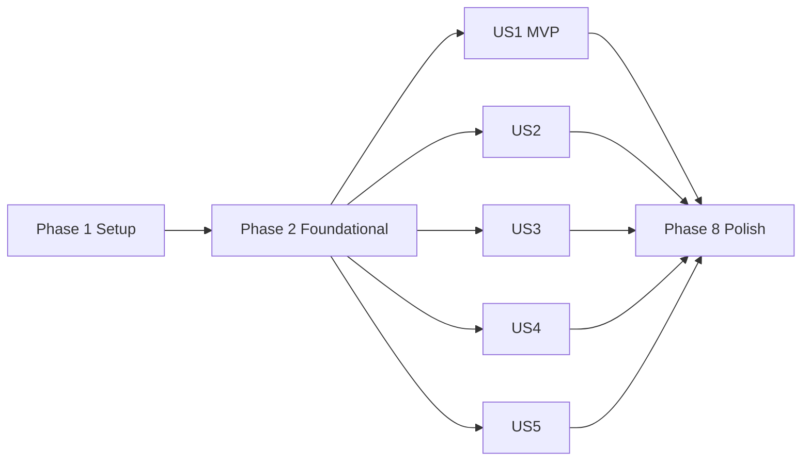

# Tasks: IT Helpdesk Agent

**Input**: Design documents from `/specs/001-it-helpdesk-agent/`

**Prerequisites**: plan.md, spec.md, research.md, data-model.md, contracts/

**Tests**: 评估套件为 spec FR-010 明确要求；各用户故事含集成测试与 YAML 评估场景。

**Organization**: 按用户故事分组，Foundational 完成后各故事可独立推进。

## Format: `[ID] [P?] [Story] Description`

- **[P]**: 可并行（不同文件、无未完成依赖）
- **[Story]**: US1–US5 对应 spec.md 用户故事

---

## Phase 1: Setup (Shared Infrastructure)

**Purpose**: 项目脚手架与依赖配置

- [x] T001 Create source directory structure (`src/agent/`, `src/tools/`, `src/models/`, `src/data/`, `src/cli/`, `tests/unit/`, `tests/integration/`, `tests/eval/scenarios/`) per plan.md
- [x] T002 Create `pyproject.toml` with Python 3.12, LangGraph, LangChain, Gemini/Anthropic SDK, Typer, Rich, Pydantic, structlog, pytest dependencies
- [x] T003 Create `.env.example` with `LLM_PROVIDER`, `GEMINI_API_KEY`, `ANTHROPIC_API_KEY` variables
- [x] T004 [P] Create `src/__init__.py` and package `__init__.py` files for all subpackages
- [x] T005 [P] Create `.gitignore` excluding `.env`, `.venv`, `__pycache__`, `.cursor/` credentials
- [x] T006 [P] Configure pytest in `pyproject.toml` with `tests/` discovery and markers for `eval`

---

## Phase 2: Foundational (Blocking Prerequisites)

**Purpose**: Mock 数据、工具层、Agent 骨架——**所有用户故事的前置依赖**

**⚠️ CRITICAL**: Foundational 完成前不得开始用户故事实现

- [x] T007 Implement all Pydantic entity schemas (Employee, KnowledgeArticle, ServiceStatus, ResolutionRecord, PolicyRule, ConversationState, EscalationPackage) in `src/models/schemas.py`
- [x] T008 [P] Create base mock KB articles (Okta, VPN, Salesforce, access) in `src/data/kb/*.md` with frontmatter (title, tags, category)
- [x] T009 [P] Create `src/data/status/services.json` with okta, salesforce, vpn-gateway, jenkins, tableau service records
- [x] T010 [P] Create mock employee records (`emp-001` Sales/Chicago, `emp-002` Data Eng, locked account user) in `src/data/users/*.json`
- [x] T011 [P] Create mock resolution history records in `src/data/history/*.json`
- [x] T012 [P] Create `src/data/policies/rules.json` with 10+ policy rules (self-service, manager approval, security approval)
- [x] T013 [P] Implement `kb_search` tool with keyword/TF-IDF retrieval in `src/tools/kb_search.py` per `contracts/agent-tools.md`
- [x] T014 [P] Implement `status_check` tool in `src/tools/status_check.py` per `contracts/agent-tools.md`
- [x] T015 [P] Implement `user_lookup` tool in `src/tools/user_lookup.py` per `contracts/agent-tools.md`
- [x] T016 [P] Implement `history_search` tool in `src/tools/history_search.py` per `contracts/agent-tools.md`
- [x] T017 [P] Implement `policy_check` tool in `src/tools/policy_check.py` per `contracts/agent-tools.md`
- [x] T018 Create unified tool response envelope and LangChain tool registry in `src/tools/registry.py`
- [x] T019 Implement environment config loader (LLM provider switch) in `src/config.py`
- [x] T020 Implement structlog JSON logging for tool calls and agent steps in `src/logging_config.py`
- [x] T021 Define `ConversationState` TypedDict and helper types in `src/agent/state.py`
- [x] T022 Create base system prompt (tool-grounded, no hallucination, clarify-first) in `src/agent/prompts.py`
- [x] T023 Implement LangGraph skeleton (intake → investigate → decide → respond) in `src/agent/graph.py` and `src/agent/nodes.py`
- [x] T024 Implement basic `EscalationPackage` builder in `src/agent/escalation.py`
- [x] T025 [P] Write unit tests for all 5 tools in `tests/unit/test_tools.py`

**Checkpoint**: 工具可独立调用，Agent 图可运行（尚未针对各场景调优）

---

## Phase 3: User Story 1 - 密码/账户问题快速恢复 (Priority: P1) 🎯 MVP

**Goal**: 员工 Okta 登录失败时，Agent 查询用户目录 + KB + 系统状态，给出修复步骤或升级

**Independent Test**: `python -m src.cli.main ask "I can't log into Okta, password reset didn't work" --employee emp-001` 应调用 user_lookup + kb_search + status_check，返回 runbook 步骤或升级包

### Implementation for User Story 1

- [x] T026 [P] [US1] Add Okta password reset and MFA unlock KB articles in `src/data/kb/kb-okta-reset.md` and `src/data/kb/kb-okta-mfa-unlock.md`
- [x] T027 [P] [US1] Add locked-account employee record with `lock_reason` in `src/data/users/emp-locked.json`
- [x] T028 [US1] Extend password/account category routing and prompt section in `src/agent/prompts.py`
- [x] T029 [US1] Implement account-lock and Okta-outage decision logic in `src/agent/nodes.py`
- [x] T030 [US1] Implement Typer `chat` and `ask` commands with Rich output in `src/cli/main.py` per `contracts/cli-api.md`
- [x] T031 [US1] Create eval scenario `tests/eval/scenarios/us1_okta_login.yaml` (expected: resolve or escalate, tools: user_lookup, kb_search, status_check)
- [x] T032 [US1] Write integration test for Okta login failure flow in `tests/integration/test_us1_okta.py`

**Checkpoint**: US1 可独立 demo——Okta 密码/锁定场景端到端可用

---

## Phase 4: User Story 2 - 软件/应用性能问题诊断 (Priority: P1)

**Goal**: Salesforce 慢速场景下，Agent 区分区域性 outage vs. 个人问题，给出 ETA 或排查步骤

**Independent Test**: 输入 Salesforce slow + Chicago 用户，Agent 应匹配 degraded 状态并给出 ETA，无需升级

### Implementation for User Story 2

- [x] T033 [P] [US2] Update `src/data/status/services.json` with Salesforce degraded status affecting Chicago region
- [x] T034 [P] [US2] Add Salesforce troubleshooting KB article in `src/data/kb/kb-salesforce-slow.md`
- [x] T035 [P] [US2] Add Chicago Salesforce slow history record in `src/data/history/hist-salesforce-chicago.json`
- [x] T036 [US2] Extend software/performance category prompts with outage-vs-personal decision rules in `src/agent/prompts.py`
- [x] T037 [US2] Implement clarify-node logic for insufficient info (browser, network, error details) in `src/agent/nodes.py`
- [x] T038 [US2] Create eval scenario `tests/eval/scenarios/us2_salesforce_slow.yaml` (expected: resolve with ETA, tools: status_check, user_lookup)
- [x] T039 [US2] Write integration test for Salesforce regional outage flow in `tests/integration/test_us2_salesforce.py`

**Checkpoint**: US1 + US2 均可独立演示 P1 核心能力

---

## Phase 5: User Story 3 - VPN/连接问题排查 (Priority: P2)

**Goal**: VPN 频繁断开时，Agent 按 KB runbook 引导排查，维护窗口时告知备用方案，无法解决时升级

**Independent Test**: 输入 VPN disconnect every 15 minutes，Agent 调用 kb_search + status_check + user_lookup 给出排查流程

### Implementation for User Story 3

- [x] T040 [P] [US3] Add VPN troubleshooting KB runbook in `src/data/kb/kb-vpn-disconnect.md`
- [x] T041 [P] [US3] Add VPN gateway maintenance entry in `src/data/status/services.json`
- [x] T042 [US3] Extend VPN/connectivity category prompts in `src/agent/prompts.py`
- [x] T043 [US3] Implement VPN-specific escalation with full diagnostic summary in `src/agent/nodes.py`
- [x] T044 [US3] Create eval scenario `tests/eval/scenarios/us3_vpn_disconnect.yaml` (expected: resolve or escalate, tools: kb_search, status_check)
- [x] T045 [US3] Write integration test for VPN disconnect flow in `tests/integration/test_us3_vpn.py`

**Checkpoint**: US3 独立可测，VPN 场景端到端可用

---

## Phase 6: User Story 4 - 权限/访问申请 (Priority: P2)

**Goal**: 权限申请时 Agent 调用 policy_check，区分可自助开通 vs. 需审批，拒绝越权操作

**Independent Test**: Data Engineering 新员工申请 Snowflake prod + Grafana，Agent 应模拟开通 Grafana、升级 Snowflake 并附审批信息

### Implementation for User Story 4

- [x] T046 [P] [US4] Add Snowflake prod and Grafana access policy rules in `src/data/policies/rules.json`
- [x] T047 [P] [US4] Add Data Engineering new hire employee in `src/data/users/emp-002.json`
- [x] T048 [US4] Extend access/permissions category prompts with policy-boundary rules in `src/agent/prompts.py`
- [x] T049 [US4] Implement policy-driven resolve (simulate grant) vs. escalate (approval required) in `src/agent/nodes.py`
- [x] T050 [US4] Create eval scenario `tests/eval/scenarios/us4_access_request.yaml` (expected: mixed resolve+escalate, tools: user_lookup, policy_check)
- [x] T051 [US4] Write integration test for access request flow in `tests/integration/test_us4_access.py`

**Checkpoint**: US4 独立可测，策略边界清晰

---

## Phase 7: User Story 5 - 复杂多系统问题升级 (Priority: P3)

**Goal**: Jenkins + Tableau + 管道多系统故障，Agent 汇总状态与历史，生成高质量升级包

**Independent Test**: 输入 pipeline failure after maintenance，Agent 应 escalate 至 Data Platform 并输出完整 EscalationPackage

### Implementation for User Story 5

- [x] T052 [P] [US5] Add Jenkins timeout and Tableau stale status in `src/data/status/services.json`
- [x] T053 [P] [US5] Add data pipeline failure history record in `src/data/history/hist-pipeline-jenkins.json`
- [x] T054 [US5] Enhance `EscalationPackage` builder with timeline, priority, target_team formatting in `src/agent/escalation.py`
- [x] T055 [US5] Extend complex/multi-system prompts and multi-tool orchestration in `src/agent/prompts.py` and `src/agent/nodes.py`
- [x] T056 [US5] Implement CLI escalation package display formatter in `src/cli/main.py` per `contracts/cli-api.md`
- [x] T057 [US5] Create eval scenario `tests/eval/scenarios/us5_pipeline_failure.yaml` (expected: escalate, tools: status_check, history_search)
- [x] T058 [US5] Write integration test for multi-system escalation flow in `tests/integration/test_us5_pipeline.py`

**Checkpoint**: 全部 5 个用户故事独立可测

---

## Phase 8: Polish & Cross-Cutting Concerns

**Purpose**: 评估套件、边缘场景、文档与可选 API

- [x] T059 Implement YAML eval runner with decision/tools/must_contain assertions in `tests/eval/runner.py`
- [x] T060 [P] Add edge-case eval scenarios (vague input, KB miss, tool failure, policy deny) in `tests/eval/scenarios/edge_*.yaml`
- [x] T061 Add Typer `tool` subcommands (kb-search, status, user, history, policy) in `src/cli/main.py`
- [x] T062 Add Typer `eval` subcommand wrapping pytest eval suite in `src/cli/main.py`
- [x] T063 [P] Implement optional FastAPI `/chat` and `/health` endpoints in `src/api/server.py` per `contracts/cli-api.md`
- [x] T064 Write `README.md` covering problem framing, architecture, escalation boundary, mock data, run instructions, evaluation, tradeoffs, future improvements
- [x] T065 Validate end-to-end setup and demo flow against `specs/001-it-helpdesk-agent/quickstart.md`

---

## Dependencies & Execution Order

### Phase Dependencies



- **Phase 1 → 2**: 顺序执行
- **Phase 2 → US1–US5**: Foundational 阻塞所有用户故事
- **US1 → US2**: US2 依赖 CLI 入口（T030），建议 US1 先完成
- **US1–US5 之间**: 逻辑独立，Foundational + CLI 完成后可并行
- **Phase 8**: 依赖至少 US1 + US2 完成（评估需 P1 场景）

### User Story Dependencies

| Story | 依赖 | 说明 |
|-------|------|------|
| US1 | Phase 2 | MVP，无其他故事依赖 |
| US2 | Phase 2, T030 (CLI) | 复用 CLI，独立 Mock 数据 |
| US3 | Phase 2, T030 | 独立 VPN 数据与 prompt |
| US4 | Phase 2, T030 | 独立 policy 流程 |
| US5 | Phase 2, T024 (escalation) | 增强升级包，不阻塞其他故事 |

### Parallel Opportunities

**Phase 2 内可并行**:
```text
T008–T012 (Mock 数据, 5 文件)
T013–T017 (5 个工具实现)
T025 (单元测试，工具完成后)
```

**各用户故事内可并行**:
```text
US1: T026 + T027 (KB + user 数据)
US2: T033 + T034 + T035 (status + KB + history)
US3: T040 + T041
US4: T046 + T047
US5: T052 + T053
```

**跨故事并行**（Foundational + CLI 完成后）:
```text
Developer A: US1 → US3
Developer B: US2 → US4
Developer C: US5 → Phase 8
```

---

## Parallel Example: Phase 2 Foundational

```bash
# 同时创建全部 Mock 数据
T008: src/data/kb/*.md
T009: src/data/status/services.json
T010: src/data/users/*.json
T011: src/data/history/*.json
T012: src/data/policies/rules.json

# 同时实现 5 个工具
T013–T017: src/tools/*.py
```

---

## Implementation Strategy

### MVP First（推荐路径）

1. Phase 1: Setup（T001–T006）
2. Phase 2: Foundational（T007–T025）
3. Phase 3: User Story 1（T026–T032）
4. **STOP & VALIDATE**: 手动 demo Okta 场景
5. Phase 4: User Story 2（T033–T039）
6. Phase 8 部分: T059–T062 评估框架 + T064 README 草稿

### Incremental Delivery

| 里程碑 | 完成任务 | 可演示能力 |
|--------|----------|-----------|
| MVP | Phase 1–2 + US1 | Okta 密码/锁定诊断 |
| Alpha | + US2 | P1 全场景 + 评估 2 场景 |
| Beta | + US3 + US4 | VPN + 权限边界 |
| RC | + US5 + Phase 8 | 完整 5 场景 + 边缘 case + README |

### 任务统计

| Phase | 任务数 | 范围 |
|-------|--------|------|
| Setup | 6 | T001–T006 |
| Foundational | 19 | T007–T025 |
| US1 (P1) | 7 | T026–T032 |
| US2 (P1) | 7 | T033–T039 |
| US3 (P2) | 6 | T040–T045 |
| US4 (P2) | 6 | T046–T051 |
| US5 (P3) | 7 | T052–T058 |
| Polish | 7 | T059–T065 |
| **Total** | **65** | |

**Suggested MVP scope**: Phase 1 + Phase 2 + US1（32 tasks, T001–T032）

---

## Notes

- 所有工具返回必须符合 `contracts/agent-tools.md` envelope 格式
- Agent prompt 必须要求引用 tool output，禁止无依据编造 KB 内容
- 评估断言优先检查 `decision` 和 `expected_tools`，避免 exact text 导致 flaky
- 每个 Checkpoint 后可独立 demo，不必等全部故事完成
- 可选 T063 FastAPI 可在 Phase 8 跳过以控制范围
